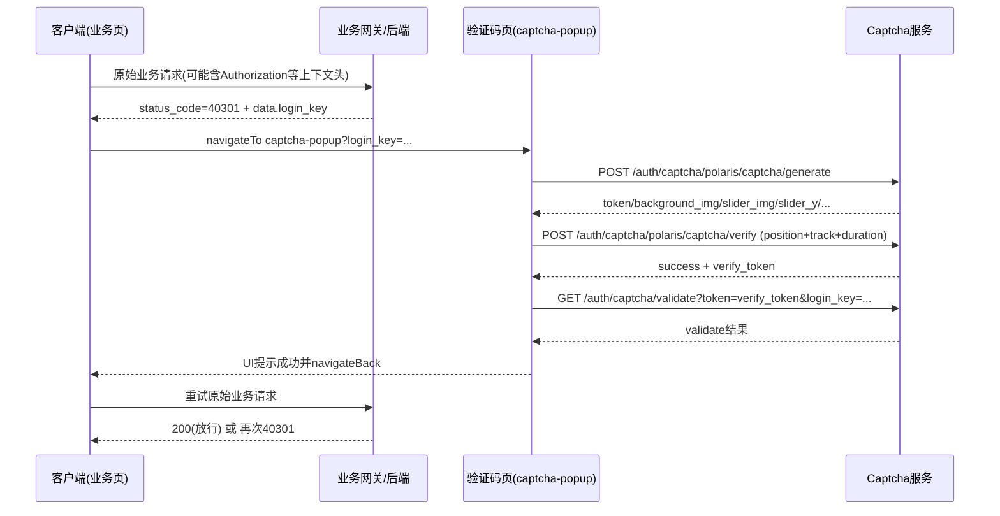

# 滑动验证码链路详解（40301 风控）

## 1. 文档目标与范围

本文基于当前仓库前端反编译产物与 Python SDK 代码，梳理 `status_code=40301` 时的滑动验证码处理链路，覆盖：

- 触发入口与页面跳转
- `generate -> verify -> validate` 三段验证码接口
- 滑轨数据（`position/track/duration`）构造方式
- 与后续“重试原请求”关联的上下文头字段
- 关键失败分支、状态机与排查点

说明：

- 本文描述的是业务实现逻辑，不提供绕过/攻击步骤。
- 后端风控判定规则（何时放行/何时继续拦截）不在此仓库，文中涉及该部分会明确标注“推断”。

---

## 2. 角色与组件

- 业务请求统一封装：`common/main.js`
- 风控触发页（当前主路径）：`pages/40301/captcha-popup.js`
- 验证码 SDK 实现（内嵌于 vendor）：`common/vendor.js` 中 `GatewayCaptchaSDK`（模块 `df2d`）
- 备选 40301 H5 容器页：`pages/40301/index.js`（当前 40301 主流程未走此页）
- Python 侧接口封装：`python_sdk/sevenma_sdk/client.py`

代码证据：

- 40301 跳转 `captcha-popup`：`common/main.js:435-443`
- SDK 常量接口路径：`common/vendor.js:30168`
- 验证码页核心逻辑：`pages/40301/captcha-popup.js:47-166`

---

## 3. 触发入口：业务接口返回 40301

统一请求成功回调里，只要响应体包含 `status_code >= 400`，会进入 `infoError` 分支：

- `common/main.js:415-417`

其中：

- `401`：未登录处理
- `40301`：弹窗后跳验证码页，并带上后端返回的 `login_key`

关键代码：

- `common/main.js:435-443`
  - `40301 == t.data.status_code`
  - `url: "/pages/40301/captcha-popup?login_key=" + t.data.data.login_key`

结论：

- `login_key` 来源于被拦截的原始接口响应体。
- 触发 `40301` 的接口可以是登录接口，也可以是登录后的业务接口（统一错误处理路径一致）。

---

## 4. 全链路时序（高层）

---

## 5. 验证码页初始化与状态机

## 5.1 初始化

`onLoad` 从路由参数读取 `login_key`，计算滑块容器尺寸并调用 `initCaptcha()`：

- `pages/40301/captcha-popup.js:47-52`

核心状态字段（节选）：

- `loginKey`, `sdk`
- `captchaImg`, `sliderImg`, `sliderY`, `token`
- `sliderX`, `track`, `startTime`, `isDragging`
- `isLoading`, `isError`, `isSuccess`

字段定义：`pages/40301/captcha-popup.js:21-45`

## 5.2 `initCaptcha()`

执行逻辑：

1. 校验 `loginKey` 是否存在（缺失则失败）
2. 复位状态
3. 创建/复用 SDK 实例（`baseUrl + loginKey`）
4. 调用 `sdk.generate("login", "slider")`
5. 按返回值填充页面（背景图、滑块图、`slider_y`、`token` 等）

证据：

- `pages/40301/captcha-popup.js:61-72`

注意：

- 这里强制请求 `type=slider`，即当前页面主路径按滑块模式拉题。

---

## 6. GatewayCaptchaSDK 细节

SDK 初始化时要求：

- `baseUrl` 必填
- `loginKey` 必填

并设置三条 API：

- `API_GENERATE = /auth/captcha/polaris/captcha/generate`
- `API_VERIFY = /auth/captcha/polaris/captcha/verify`
- `API_VALIDATE = /auth/captcha/validate`

证据：

- `common/vendor.js:30166-30169`

## 6.1 `generate(scene, type)`

默认 `scene=login`，将如下参数发给后端：

- `scene`
- `device_id`（SDK 本地生成/缓存）
- `login_key`
- `client_info.user_agent/screen/language`
- `type`（有值才传）

证据：

- `common/vendor.js:30178-30192`

返回 `code==0` 时取 `data`，否则抛错：

- `common/vendor.js:30193-30199`

## 6.2 `verify(token, payload)`

请求体：

- `token`
- `position: {x, y}`
- `track: []`
- `device_id`
- `duration`

证据：

- `common/vendor.js:30224-30233`

当验证码服务返回成功后，SDK 会继续调用 `_validateToGateway(verify_token)`：

- `common/vendor.js:30235-30249`

## 6.3 `validate`

请求：

- `GET /auth/captcha/validate?token={verify_token}&login_key={login_key}`

证据：

- `common/vendor.js:30272-30273`

## 6.4 SDK 设备标识

SDK 会在本地缓存 `gateway_captcha_device_id`，没有则生成：

- `device_${random}${timestamp}`

证据：

- `common/vendor.js:30289-30290`

---

## 7. 滑块轨迹参数如何生成

## 7.1 手势开始

`onTouchStart`：

- 记录起始触点 `startX`
- 记录开始时间 `startTime`
- 初始化轨迹 `track=[{x:0,y:0,t:0}]`

证据：

- `pages/40301/captcha-popup.js:88-94`

## 7.2 手势移动

`onTouchMove`：

- `deltaX = currentX - startX`
- 限制在 `[0, maxMove]`
- 更新 `sliderX`
- 追加轨迹点 `{x: round(sliderX), y:0, t: now-startTime}`

证据：

- `pages/40301/captcha-popup.js:95-104`

## 7.3 手势结束并换算坐标

`onTouchEnd`：

- `duration = now - startTime`
- `position.x = round(sliderX / imgScale)`（UI坐标转图片坐标）
- `track[].x` 同样按 `imgScale` 反算
- 调 `sdk.verify(token, {x, y, track, duration})`

证据：

- `pages/40301/captcha-popup.js:119-130`

---

## 8. 验证成功/失败后的行为

## 8.1 成功

页面按 `c.success` 判定成功：

- toast “验证通过”
- 1.5 秒后关闭并 `navigateBack`

证据：

- `pages/40301/captcha-popup.js:132-136`

重要细节：

- SDK 实际还计算了 `gateway_validated`，但页面成功判定只看 `c.success`。
- 即：前端 UI 成功与网关最终放行结果不完全同一层语义。

证据：

- `common/vendor.js:30249`
- `pages/40301/captcha-popup.js:132`

## 8.2 失败

失败会：

- toast “验证失败，请重试”
- 标记错误态并回弹
- 1 秒后重新 `initCaptcha()`

证据：

- `pages/40301/captcha-popup.js:149-156`

---

## 9. Header 上下文：风控关联的关键线索

客户端请求头基线：

- `Accept`, `Client`, `Phone-*`, `App-Version`, `X-App-ID`

证据：

- `common/main.js:98-103`

动态上下文头（更关键）：

- `Authorization`（登录后）
- `X-Trace-Id`
- `U-User-Id`
- `GenieLamp-H-session`

证据：

- `common/main.js:119-125`, `152-156`

响应头学习逻辑：

- 从响应头读取 `X-Trace-Id` 并保存
- 从响应头读取 `GenieLamp-H-session` 并缓存（本地约 10 分钟）

证据：

- `common/main.js:404-407`
- `common/main.js:389-399`

实现细节：

- `GenieLamp-H-session` 仅在本地当前无值时才写入新值（非每次刷新覆盖）。

---

## 10. “完成挑战后如何恢复业务”

页面 `captcha-popup` 成功后只做 `navigateBack`，不会自动重放被拦截请求。

证据：

- `pages/40301/captcha-popup.js:135`

因此业务恢复通常是：

1. 返回上一个业务页面
2. 由页面逻辑或用户动作重试原接口
3. 若上下文一致且后端判定通过，则返回 200；否则可能继续 40301

这也是“挑战通过后仍偶发再次 40301”的常见原因之一（后端规则/上下文变化）。

---

## 11. 登录场景与已登录业务场景的共性/差异

## 共性

- 都由统一错误处理捕获 `40301`
- 都依赖 `login_key` 开启验证码挑战
- 都走同一套 `generate/verify/validate`

## 差异

- 登录场景原请求通常是 `POST /auth/login`（短信验证码登录）
  - 证据：`pages/auth/verificationcode.js:108-116`
- 已登录场景原请求可以是任意业务接口（`get/post/...`）
  - 统一处理证据：`common/main.js:258-379` + `415-443`

---

## 12. Python SDK 对应能力

Python SDK 已提供三段接口：

- `captcha_generate(...)`
- `captcha_verify(...)`
- `captcha_validate(...)`

证据：

- `python_sdk/sevenma_sdk/client.py:155-210`

并将业务 `40301` 映射为异常：

- `CaptchaRequiredError`

证据：

- `python_sdk/sevenma_sdk/client.py:446-447`

SDK 也支持携带关键上下文头：

- `Authorization`, `X-Trace-Id`, `U-User-Id`, `GenieLamp-H-session`

证据：

- `python_sdk/sevenma_sdk/client.py:497-503`

---

## 13. 风险点与待确认项（给联调/排查）

1. 前端 UI 成功条件仅 `c.success`，未显式要求 `gateway_validated=true`（实现一致性风险）。
2. `captchaType==='click'` 的 UI 分支存在，但当前页面代码未见完整点击逻辑实现（与 slider 主路径不一致）。
3. `GenieLamp-H-session` 更新策略是“有值则不覆盖”，是否与后端轮换策略完全一致需实测验证。
4. 后端风控规则（字段权重、TTL、设备/IP维度）前端不可见，最终以网关日志与抓包结果为准。

---

## 14. 调试清单（建议）

1. 记录触发 `40301` 的原始接口、请求头、响应体 `login_key`。
2. 确认 `generate/verify/validate` 三步都返回成功（尤其 `validate`）。
3. 核对挑战前后 `Authorization/X-Trace-Id/U-User-Id/GenieLamp-H-session` 是否按预期连续。
4. 确认挑战完成后的原请求是“同参数重试”，并在有效时窗内执行。
5. 若仍反复 40301，对照网关日志查看命中规则类型（设备、行为、频率、网络环境等）。

